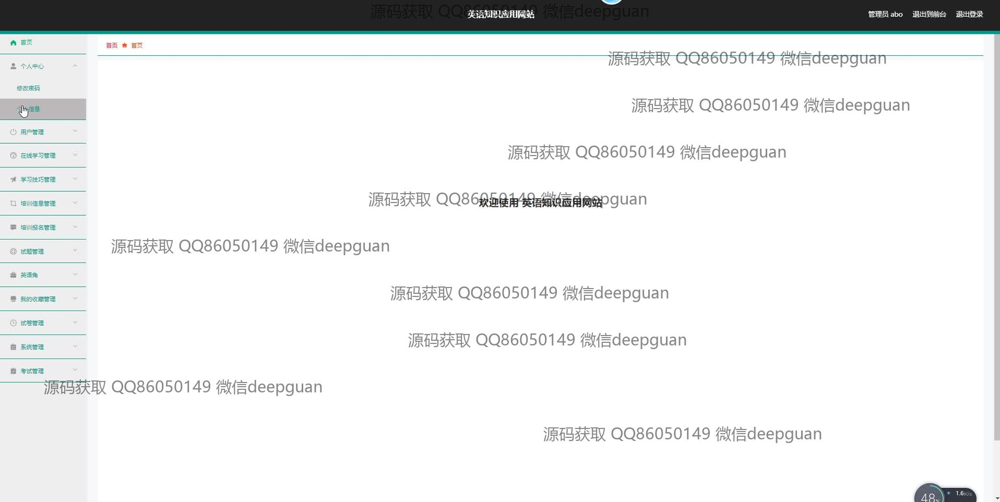
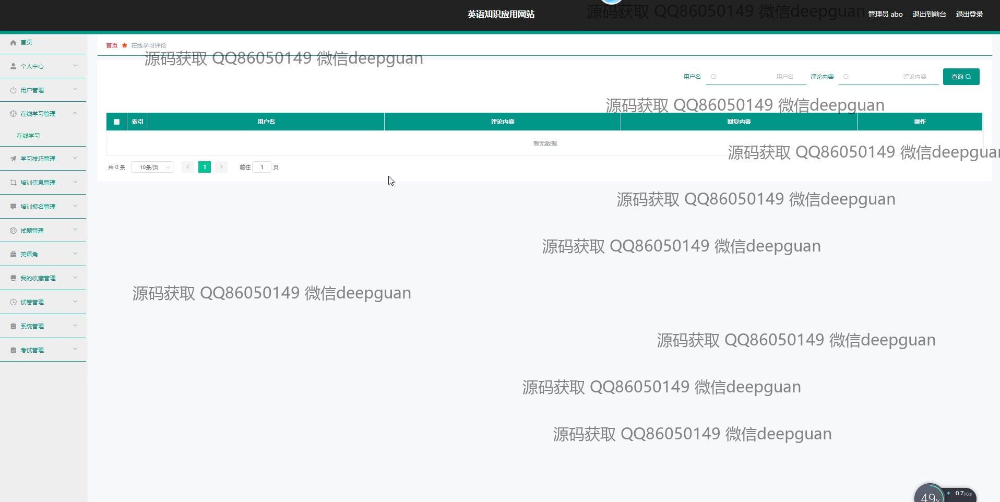
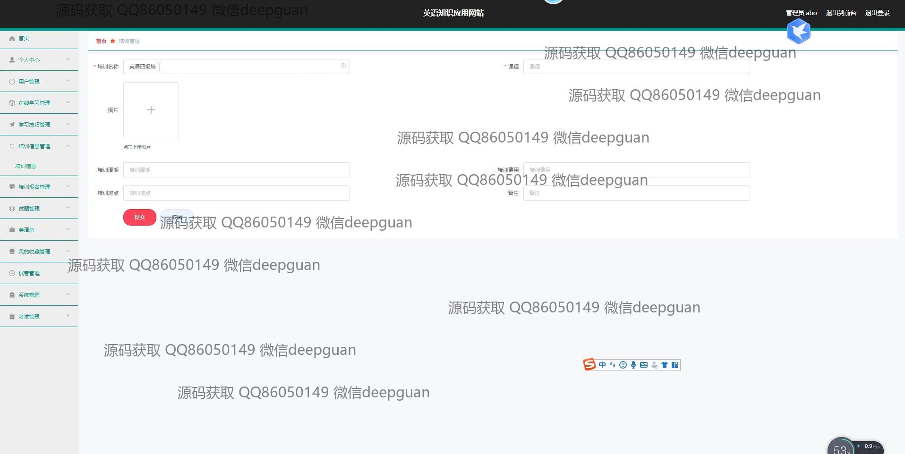
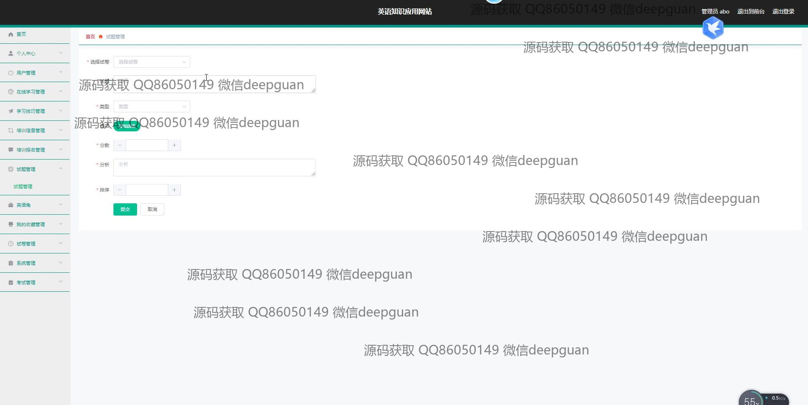
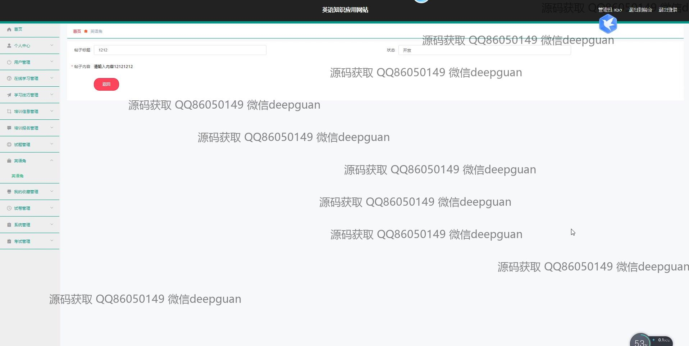

<h1 align="center">英语知识应用网站的设计与实现</h1>

## 简介
英语知识应用网站：角色分为管理员、用户；主要功能包括用户管理、在线学习、考试管理、试题编辑、培训信息管理、学习技巧分享、论坛互动、个性化学习推荐和进度跟踪。    --计算机毕业设计源码；毕设源码；java毕业设计源码

## 联系方式

<h3 align="center">获取完整代码与数据库文件 + 微信：deepguan QQ: 86050149 QQ群: 783742310</h3>

<h3 align="center">可帮忙远程部署 包运行成功！提供远程部署、修改代码、设计文档指导、代码讲解等服务！</h3>

## 功能介绍（完整见运行截图）
管理员： 英语知识应用网站的管理员具有全面的管理权限，包括用户管理、试题管理、培训信息管理、在线客服管理等功能。管理员可以在后台登录进行网站内容的创建与编辑，上传学习资源并管理用户的学习进度和考试记录。此外，管理员可以通过论坛和评论管理等提高用户互动，通过提供试题、评论和反馈促进学习体验的提升。

用户： 用户可以通过注册和登录访问英语知识应用网站，在个人中心管理他们的基本信息和学习进度。平台提供多种学习模块，如在线学习、学习技巧、考试与测验等，用户可以浏览和参与。此外，用户还可以在论坛中发布帖子，与其他学习者互动，加强沟通与交流。用户界面设计简洁，通过清晰的导航栏便捷访问各项学习资源和管理工具，提升学习效果和便利性。

## 运行截图

本代码来源于网络,仅供学习参考使用!

